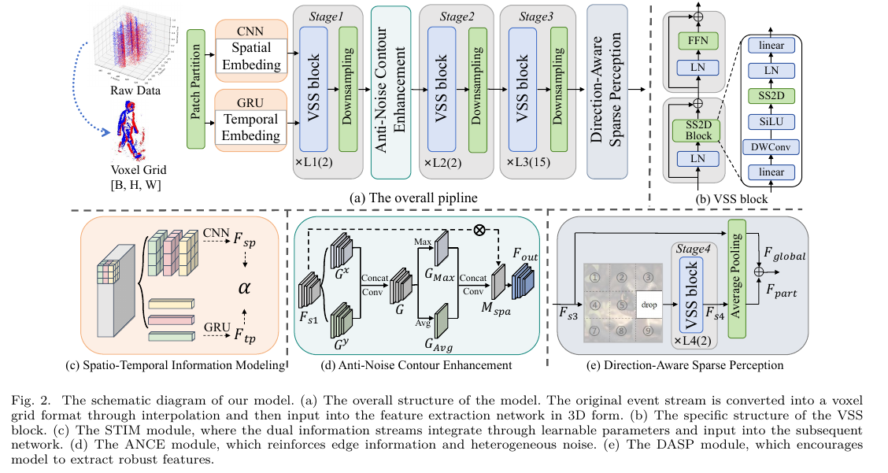
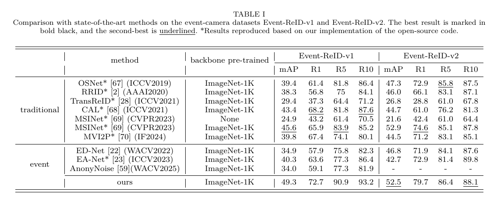
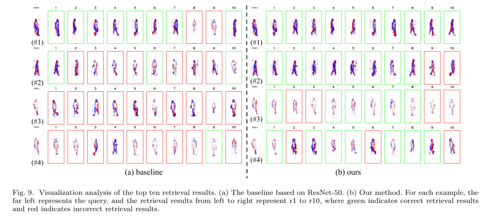

<div align="left">

# Sparse VMamba: Robust Spatio-Temporal Information Modeling for Event Camera Person Re-Identification (TIFS 2026)

</div>

<p align="left">
Official PyTorch Implementation of Sparse VMamba: Robust Spatio-Temporal Information Modeling for Event Camera Person Re-Identification
</p>

<p align="left">
  <a href="https://ieeexplore.ieee.org/document/11367033">📄 Paper</a>
</p>

---

# Abstract

</div>
Event camera-based person re-identification (Re-ID) effectively addresses the challenges faced by traditional Re-ID systems, such as privacy leakage, low-light imaging degradation, and motion blur. However, traditional Convolutional Neural Networks (CNNs) struggle to model long-range spatio-temporal dependencies, while the Transformer architecture encounters fundamental conflicts with second-order computational complexity and the high temporal resolution of event streams. Additionally, sparse data leads to wasted computational resources and diluted effective data. In contrast, the Mamba architecture, with its long-term modeling capability and linear complexity, is better suited for event stream data. Therefore, we innovatively explore the potential of VMamba in event camera-based person Re-ID; however, directly using VMamba does not fully leverage the temporal asynchronicity and spatial sparsity inherent in event data. To address this, we design a novel Sparse VMamba framework to construct a more robust spatio-temporal information extraction mechanism. First, we develop a Spatio-Temporal Information Modeling (STIM) module that simultaneously employs CNNs and Gated Recurrent Units (GRUs) for modeling spatial and temporal information. Then, we enhance the robustness of sparse data feature extraction using two strategies: on one hand, we utilize Anti-Noise Contour Enhancement (ANCE) module to improve motion contour features and mitigate sensor pulse noise; on the other hand, we implement Direction-Aware Sparse Perception (DASP) module to encourage the model to extract robust person descriptors. Results on the Event-ReID-v1 and Event-ReID-v2 datasets validate the effectiveness of our approach. 
---


# Framework Overview

<p align="center">
  
</p>

---


# Experimental Results


## Results

<p align="center">
  
</p>

### Models
<a href="https://pan.quark.cn/s/9d631a693c8e">Download</a> 


---

# Visualization Results


## Rank10 results

<p align="center">
  
</p>

---

# Citation

If you find this project useful for your research, please consider citing:

```bibtex
@article{dong2026sparse,
  title={Sparse VMamba: Robust Spatio-Temporal Information Modeling for Event Camera Person Re-Identification},
  author={Dong, Wenjiao and Yang, Xi and Wang, Nannan},
  journal={IEEE Transactions on Information Forensics and Security},
  year={2026},
  publisher={IEEE}
}

```

---

<div align="center">

</div>

</div>
